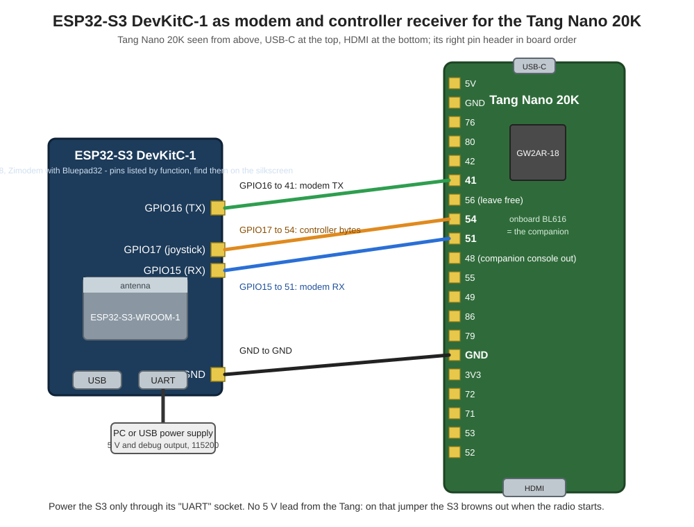

# Loading files onto the SD card over WiFi (ESP32-C3 or ESP32-S3 as modem)

This fork lets the companion pull files from a web server on your PC
straight onto the SD card in the Tang Nano 20K, chosen from the OSD. A
disk image for the Atari ST goes from a folder on the PC to drive A in
about half a minute, no card swapping.

The Tang Nano 20K's onboard BL616 has no antenna, so the network comes
from an ESP32 on the free M0S connector, an ESP32-C3 SuperMini or an
ESP32-S3 DevKitC. It runs Zimodem and serves two masters: the ST uses it
as a Hayes modem on the serial port, and the companion uses it to fetch
files. Both are just AT commands.

## What you need

- Tang Nano 20K with the MiSTeryNano core from
  https://github.com/rcdev67/MiSTeryNano, branch `nano20k-running`
  (second serial port on the M0S connector, SD controller fixes)
- this companion, branch `net-download`, built for `TANG_BOARD=nano20k`
- an ESP32-C3 SuperMini or an ESP32-S3 DevKitC-1 with Zimodem from
  https://github.com/rcdev67/Zimodem (branch `c3-supermini-misterynano`,
  images on the release page)
- a PC on the same WiFi with Python 3

## Wiring

| ESP32-C3 SuperMini | Tang Nano 20K |
|---|---|
| pin 7 (GPIO7, TX) | 41 |
| pin 6 (GPIO6, RX) | 51 |
| GND | GND |
| 5V | 5V |

Power the C3 from the Tang only, plug it in or out with the board off,
and keep the 5V lead short: a thin jumper sags under WiFi bursts. Pin 56
stays untouched.

| ESP32-S3 DevKitC-1 | Tang Nano 20K |
|---|---|
| GPIO16 (TX) | 41 |
| GPIO15 (RX) | 51 |
| GPIO17 (joystick, Bluetooth build) | 54 |
| GND | GND |

The S3 draws more when its radio starts than a jumper from the Tang's 5V
pin delivers; on that lead it reset at every WiFi join. Power it through
its "UART" USB socket instead, from the PC or a USB supply, and share
only ground with the Tang. That socket also shows the modem's debug
output at 115200 baud. Its bigger antenna gives a steadier link than
the C3's.

## One-time setup

1. Flash Zimodem to the C3 or S3 (see the release page).
2. Put your WiFi and the PC's address with a port into `atarist.ini` on
   the card:

       wifi=MyNetwork,MyPassword
       server=192.168.1.20:8888
       timezone=CEST

   The companion hands the network to the modem the first time it finds
   it without one, and the modem keeps it from then on; no terminal
   program on the ST is needed. (It still works the old way, `atw"MyNetwork,MyPassword"`
   and `at&w` from a terminal program.) A password may contain spaces,
   the line is taken as it is up to its end.

   `timezone` is optional: once the modem is online the companion takes
   the time from it and sets the ST's clock, in that time zone (a Zimodem
   code such as `CET`, `CEST`, `GMT`, `EST`; without the line it is UTC).
   The modem knows no daylight saving rules, so in Germany it is `CET` in
   winter and `CEST` in summer. TOS reads the clock when it starts, so the
   right time shows after the next reset.

   The port must be free on the PC; 8000 is often taken by Windows itself.
3. Make a folder on the PC for the files, say `C:\atari\share`, and start
   the server there. Windows PowerShell:

       cd C:\atari\share; python -m http.server 8888 --bind 192.168.1.20

   Linux or macOS:

       cd ~/atari/share && python3 -m http.server 8888 --bind 192.168.1.20

   Use the PC's own LAN address after `--bind`. Windows may ask once whether
   Python may accept connections: allow it for private networks. The window
   shows every request the Atari makes, which is handy when something does
   not work.
4. Put the files into that folder. That is all: the companion reads the
   folder listing the server shows for `/`. Names may be long and may
   contain spaces, they arrive on the card as they are. `.ST` disk images
   are what the OSD's disk selector lists afterwards.

   If you would rather hand out a fixed list, serve a plain text file
   instead of the listing: one file name per line, `;` starts a comment.

## Using it

1. Open the companion menu with Shift+F12 and choose `Download...`.
2. `Load file list` fetches the folder listing and shows the names.
3. Pick a file. A bar shows the progress, the end says how many bytes
   arrived. The file lands in the root of the card.
4. F12, `Disk A:`, pick the new image. Games usually want a cold start:
   set `Video: Color` if needed and use the reset entry, TOS reads the
   monitor type only at boot.

The `Serial:` setting in the OSD does not matter for downloads: the
companion switches the port to itself for the request and puts your
setting back afterwards. During a download the ST has no modem, that is
the one moment the two masters cannot share it.

## How it works

The companion talks to the modem over port 1 of the core's port protocol,
a second UART in the FPGA on the M0S pins. It sends
`AT&G"xmodem:http://server:port/name"`. Zimodem opens the resource and
hands it over straight from the connection in XMODEM blocks, each one
checked and acknowledged, so a byte lost on the serial line costs a
repeated block, not the file. Nothing is staged in the modem, so the
size is not limited by its flash. For the transfer both sides switch to
460800 and back to 19200 afterwards, so the ST finds its modem as it
left it. The core's port FIFOs hold 255 bytes for that, which is why the
companion and the core from the branches named above belong together.

A Bluetooth controller can join in as well, on a separate line to pin 54:
see the Zimodem fork's MISTERYNANO.md. That build belongs on the S3, on
the C3 the radio cannot serve WiFi and Bluetooth at once well enough.

Every result is appended to `NETLOG.TXT` in the root of the card. If a
download fails, that line says why. Should the modem ever go quiet, the
companion writes the port's state into the log and resets the port, the
same as switching `Serial:` away from `Netz` and back by hand.

## Other hardware

The same companion runs on the M0S Dock and, with its own port, on an
ESP32-S3. Both have WiFi of their own, so no modem is needed there and
the maintainer's FTP server is available as well. This document covers
the Tang Nano 20K with its onboard BL616, where an ESP32 modem is the
way to get a network at all.
